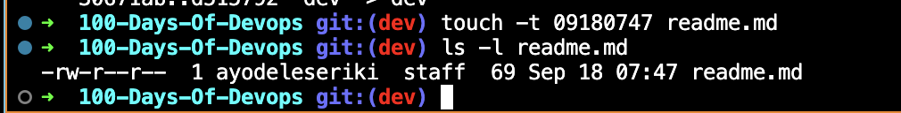

# Intro to the command line
## some basic utilities
- **cat**: used to type out a file (or combine files).
- **head**: used to show the first few lines of a file.
- **tail**: used to show the last few lines of a file.
- **man**: used to view documentation.
- **|** (pipe) is used to take the output of one program and make it the input of another

## Sudo
Sudo capabilities provde users with administrative(admin) priviledges when required

## Virtual Terminals
**Virtual Terminals (VT)** are console sessions that use the entire display and keyboard outside of a 
graphical environment. Such terminals are considered "virtual" because, although there can be multiple
 active terminals, only one terminal remains visible at a time. 

## Basic Operations
<!-- `which diff` - To find out exactly where the diff program(/usr/bin) resides on the file system
`
$ which diff
/usr/bin/diff
`
`pwd` - Displays the present working directory
`cd ~` or `cd` - Change to your home directory; shortcut name is ~ (tilde)
`cd ..` - Change to parent directory (..)
`cd -`- Change to previous working directory; - (minus) -->

## Absolute and Relative Paths
**Absolute path** - absolute pathnames begin with the root directory(/) and follows the tree branch by branch,
  until it reaches the desired directory, this path always starts with /.
**Relative path** - starts from the present working directory, never starts with (/)

# Working With Files
## Commands and their Usage
*cat -	Used for viewing files that are not very long; it does not provide any scroll-back.
*tac -	Used to look at a file backwards, starting with the last line.
*less -	Used to view larger files because it is a paging program.
*tail -	Used to print the last 10 lines of a file by default. You can change the number of 
        lines by *doing -n 15 or just -15 if you wanted to look at the last 15 lines instead of the default.
*head -The opposite of tail; by default, it prints the first 10 lines of a file.

## Touch
Touch is often used to set or update the access, change, and modify times of files. By default, it resets a 
file's timestamp to match the current time. We can also use the touch command to create an empty file.

## Pipe
You can pipe the output of one command or program into another as its input.

## Searching for files
- Locate
The locate command in Linux is used to search for files and directories on your system using a pre-built 
index. It is a fast and efficient way to locate files based on their names. 
We can use it with grep to produce shorter results i.e
`$ locate zip | grep bin`
which will list all the files and directories with both zip and bin in their name

- WILDCARDS
* To search for files using the ? wildcard, replace each unknown character with ?. For example,
if you know only the first two letters are 'ba' of a three-letter filename with an extension of .out, type ls ba?.out.

* To search for files using the * wildcard, replace the unknown string with *. For example, if
you remember only that the extension was .out, type ls *.out.

## Finding files based on time and size
