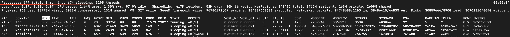
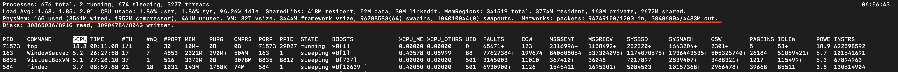

What's a PROCESS?
It is an instance of one or more tasks executing on our computers. It is differnrt from a program 
or a command. A single command might start several processes simultaneously
Processes use the computer's resources, such as it's CPU

 
|   PROCESS TYPE      |                    DESCRIPTION                               | EXAMPLES    |
|---------------------|--------------------------------------------------------------|-------------|
|Interactive Processes|Needs to be started by a user either through the CLI or GUI   |Bash         |                                                                      
|Batch Processes      |Automatic process scheduled and disconnected from the terminal|updatedb     |                                                                      
|Daemons              |Many processes that are launched during startup, they run     |httpd        |
|                     |continously till they're service is required by a user        |             |
|                     |or the system                                                 |             |  
|Threads              |Lightweight processes                                         |dconf-service| 
|Kernel Threads       |These are kernel tasks that users can neither start not       |kthreadd     |
|                     |terminate and have little control over                        |             |                                                                     

Users and Group ID
* The user who starts a process is identified by the real user id (RUID)
* The user who determines the access rights for the users is identified by the Effective UID (EUID).
* The EUID may or may not be the same as the RUID.

* The priority for a process can be set by specifyng a nicce value, the higher the nice value the 
  lower the priority and vice versa

PROCESS METRICS AND PROCESS CONTROL
===================================
Listing Processes: ps and top
* PS (process status) provides information about currently running processes keyed by PID

* pstree displays the processes running on the system in the form of a tree diagram showing the relationship
between a process and its parent process and any other processes that it created 

* We can monitor the systems live performance over time using ps command, but we might have to run 
it periodically, a better option would be to use the top command which reports back every 2 seconds 
until we quit using `q top` command

* The first line of the top command displays a quick summary of what is happening in the system.
The load average determines how busy the system is, an average of 1 indicates a full busy but 
not overloaded sytem, an average above that indicates an overloaded system in which processes
are competing for CPU time.
{: style="height:150px;width:150px"}

* The second line displays the total number of running processes, comparing the number of running processes 
and the load average helps to determine if the system has reached capacity or a user is running too many processes. 
{: style="height:150px;width:150px"}

* The third line of the top output tells us how the CPU time is being shared between the users(us) and the kernel(sy)
by displaying the percentage of CPU time used for each.
ni -niceness
id -idle mode, should be low if average load is high and vice versa
wa -jobs waiting
hi -hardware interrupt
si -software interrupt
st -steal time
{: style="height:150px;width:150px"}

* Once the physical memory is used up, the system starts  to use swap space(temporary storage space on hard drive),
and since accessing disk is much slower than accessing memory, this will negatively affect system 
performance

* The other acronyms meaning are as  follows
Process Identification Number (PID)
Process owner (USER)
Priority (PR) and nice values (NI)
Virtual (VIRT), physical (RES), and shared memory (SHR)
Status (S)
Percentage of CPU (%CPU) and memory (%MEM) used
Execution time (TIME+)
Command (COMMAND).

STARTING PROCESSES IN THE FUTURE
* **at** executes any non-interactive command at a specific time.
* **cron** is a time based scheduling utility. It can launch routine background jobs at specific times and/or
dayson an ongoing basis
* Another one is **anacron**, cron can only work when the system is up, anacron can run in a controlled
and staggered manner
* The key difference between **cron** and **anacron** lies in their scheduling approach and their ability to handle
missed tasks. Cron is suitable for tasks that need to run at precise times or intervals, while Anacron is 
designed for tasks that need to be executed periodically but not at specific clock times and can handle missed
tasks when the system is not continuously running.
* **sleep** suspends execution for at leaset the specified period of time, which can be given as the number of seconds(default),
minutes, hours, days. After that time has passed execution can resume.
    * The syntax is `sleep number[suffix]` suffix can me s,m,h,d``
    * sleep and at are quite different; sleep delays execution for a specific period, while at starts execution at 
      a specific designated later time.